# Library management web api
## Introduction

Library Management system with dot net web api and EF core, Postgres db 

---

## API Endpoints

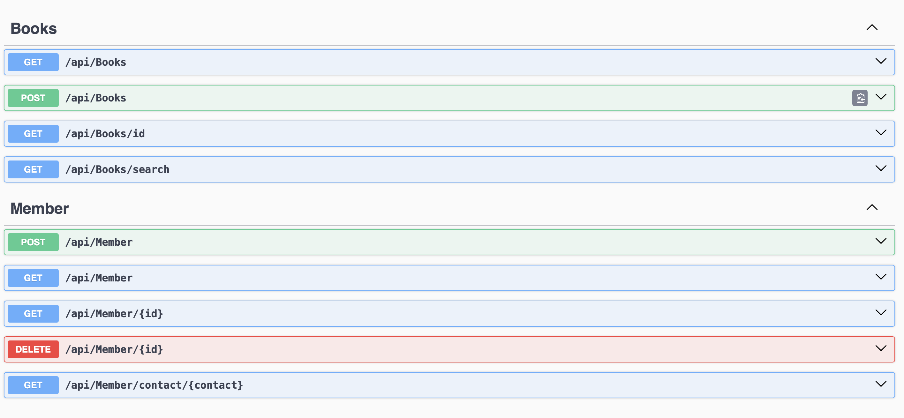

---
## Get books

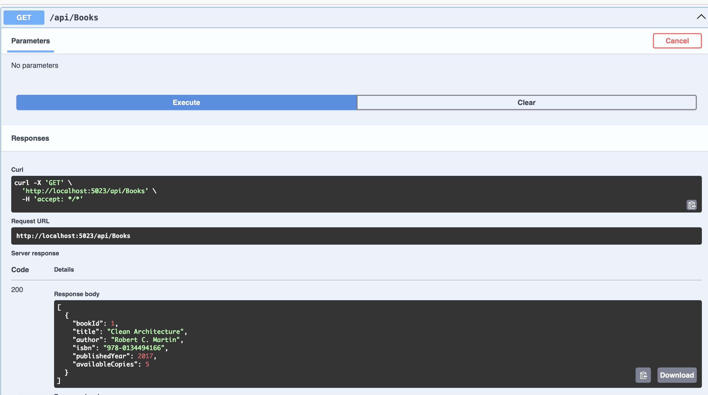

---
## Get members

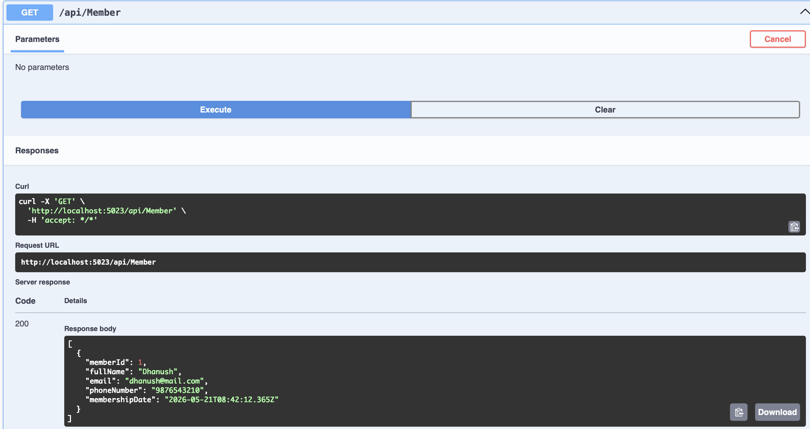

---

---
## Get member by id

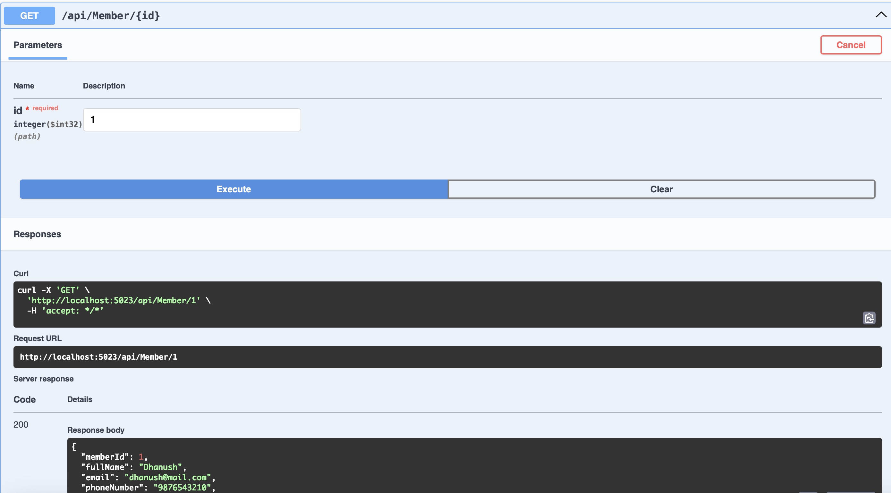

---
## POST member

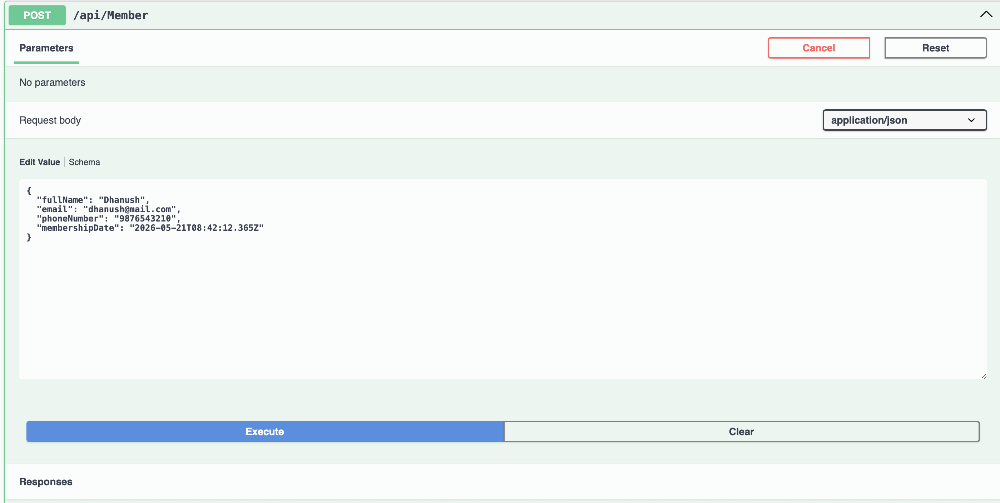

---
## POST member res

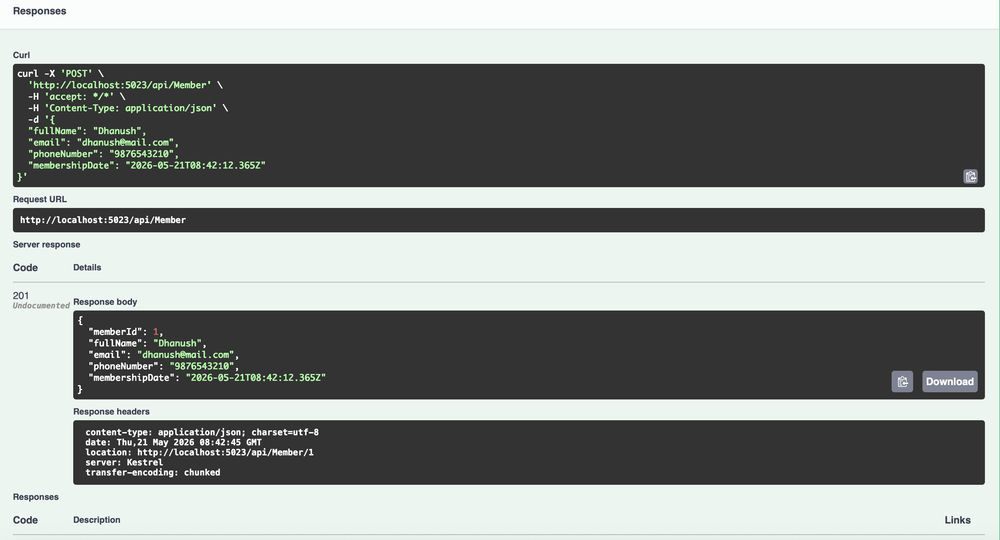

---
## Search books

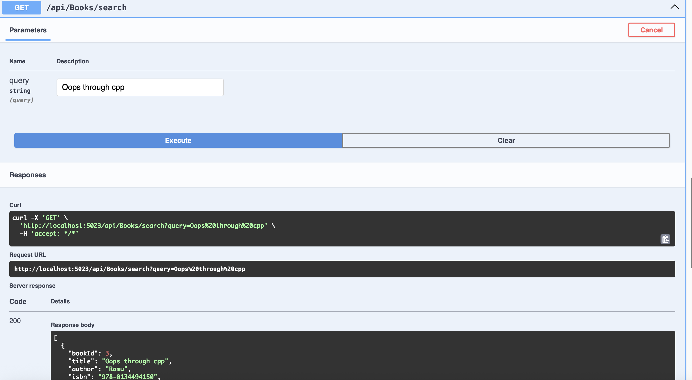

**:** search books using query title author isbn

---
## DATABASE tables

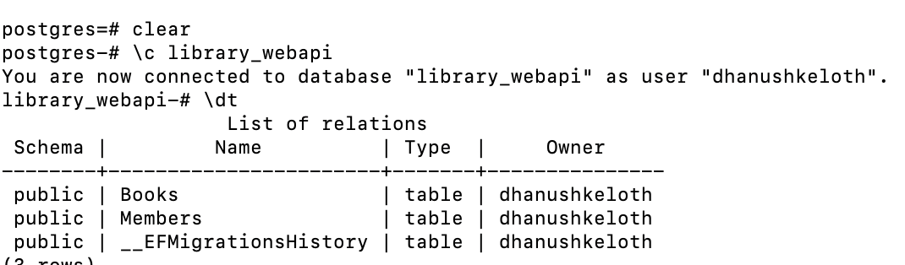

---
## Books table

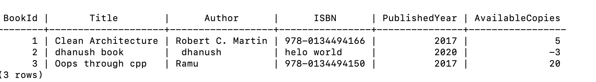

---
## Member table

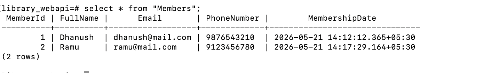

---
## ERD

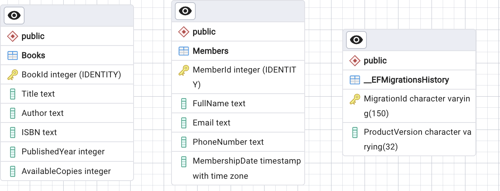

---

